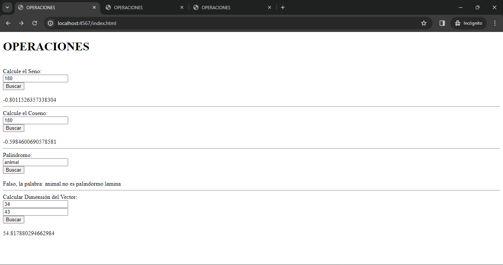
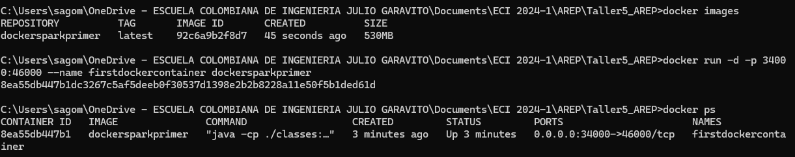
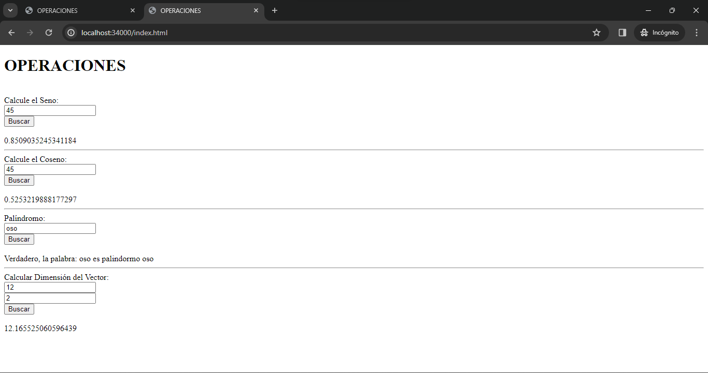
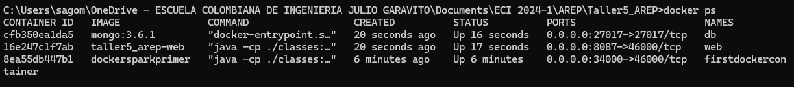
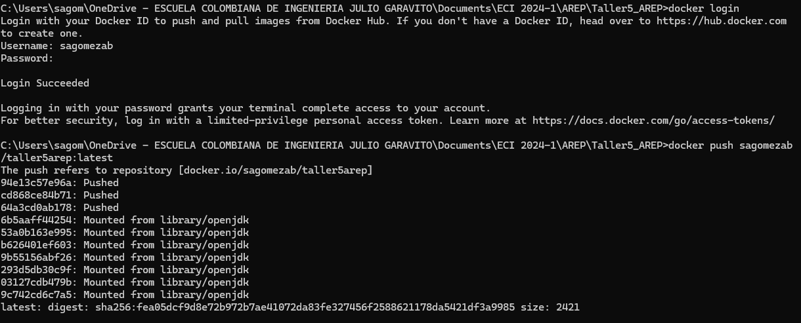
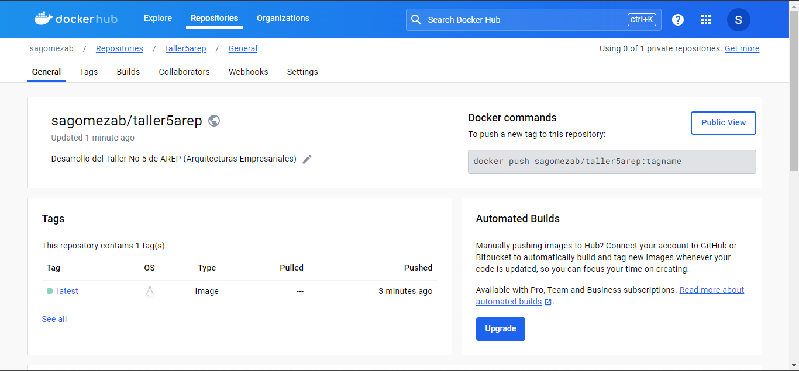
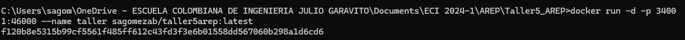
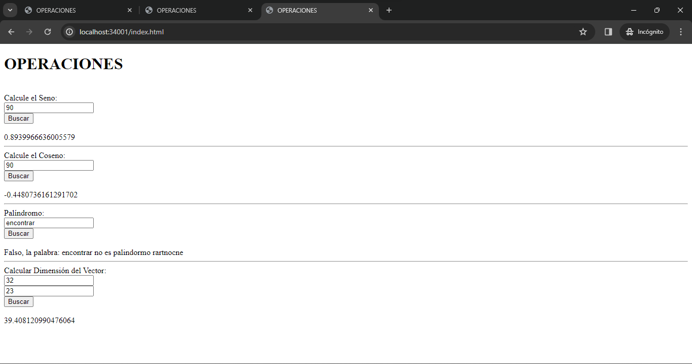

# TALLER 5: MODULARIZACIÓN CON VIRTUALIZACIÓN E INTRODUCCIÓN A DOCKER

#### Hecho por: Daniel Santiago Gómez Zabala

Se ha creado un servicio en Spark capaz de responder a peticiones y realizar cálculos de seno, coseno, verificación de palíndromos y cálculo de la dimensión de un vector. Además, se ha implementado el empaquetado de la aplicación en un contenedor Docker para permitir su ejecución desde Docker Hub.

## GETTING STARTED

1. Debe tener instalado **Maven** en su computador para poder ejecutar los comandos que se le indicarán más adelante.
2. Debe contar con **GITHUB** para poder hacer uso del repositorio donde se alberga el laboratorio.
3. Debe tener un ambiente de **java** para poder visualizar y ejecutar el codigo.
4. Debe tener **Docker** como sistema de control de contenedores.
5. Acceso a **Docker HUB**

## INSTALLING 

Debe clonar el respositorio para poder hacer uso de la app con el comando que se encuentra a continuación

```
git clone https://github.com/sagomezab/Taller5_AREP.git
```

Realice el siguiente comando para asegurar la instalación de paquetes necesarios para la ejecución de la apliación

```
mvn clean install
```

Para correr de manera local la aplicación debe ejecutar el siguiente comando desde el CMD (Símbolo del Sistema):

```
java -cp "target/classes;target/dependency/*" edu.escuelaing.sparkdockerdemolive.SparkWebServer
```

Después ingrese al siguiente link para comprobar el funcionamiento de la aplicación

```
http://localhost:4567/index.html
```
Visualizará lo siguiente:



## Test

Para realizar pruebas induviduales de los enpoints será necesario ingresar con los siguientes enlaces al browser y despues de cada "=" ingresar los valores que desea calcular o analizar:

```
http://localhost:4567/sin?angle=
http://localhost:4567/cos?angle=
http://localhost:4567/palindromo?word=
http://localhost:4567/dimension?x=&y=
```

## Execution Local Docker with Container
Se debio configurar el archivo *Dockerfile* después de ello se realizarón la creación de los contenedores que ejecutarán la apliacición dentro del docker del computador personal los comandos utilizados fueron:

```
docker build --tag dockersparkprimer .
docker images
```

Al usar el siguiente comando va a ejecutar la aplicación, cabe aclarar que puede usar este comando varias veces. Sin emabargo, debe cambiar el nombre del contenedor *firstdockercontainer* y el puerto por el que escucha *34000*:

```
docker run -d -p 34000:46000 --name firstdockercontainer dockersparkprimer
```
Al ejecutar los comando encontramos lo siguiente:



Para hacer una revisión de los contenedores corriendo puede usar el comando **docker ps**

Ahora puede ingresar con el siguiente link para visualizar el contenido del contenedor y comprobar el funcionamiento de la apliación



## Execution with DockerHub

Ahora se va a relizar el cargue del contendor del al repositorio de DockerHub, antes de realizar esto se debio configurar el archivo *docker-compose.yml*

Se deben usar los siguiente comandos para la realización del push al repositorio:

```
docker-compose up -d
docker ps
```


Debe crear una etiqueta de la imagen de Docker existente, eso lo realiza con el siguiente comando:

```
docker tag dockersparkprimer sagomezab/taller5arep
```
Revise, las images, ingrese a su cuenta de DockerHUB y haga push al repo previamnete creado.

```
docker images
docker login
docker push sagomezab/taller5arep:latest
```
Asi se ve desde el CMD:



Luego de haber realizado esos pasos debe visualizar en su repositorio de DockerHUB la imagen
```
https://hub.docker.com/repository/docker/sagomezab/taller5arep/general
```


Para ejecutar la imagen desde el repositorio debe ingresar el siguiente comando, debe tener en cuenta que si tiene el puerto *34001* en uso debe cambiarlo para ejecutar la aplicación:

```
docker run -d -p 34001:46000 --name taller sagomezab/taller5arep:latest
```

Asi se ve el comando desde el CMD:



Y asi se ve desde el browser ingresando con el siguiente link:

```
http://localhost:34001/index.html
```



## Built With

* [Maven](https://maven.apache.org/) - Administrador de dependencias

## Version

2.0
## Author

Daniel Santiago Gómez Zabala [SAGOMEZAB](https://github.com/sagomezab)

